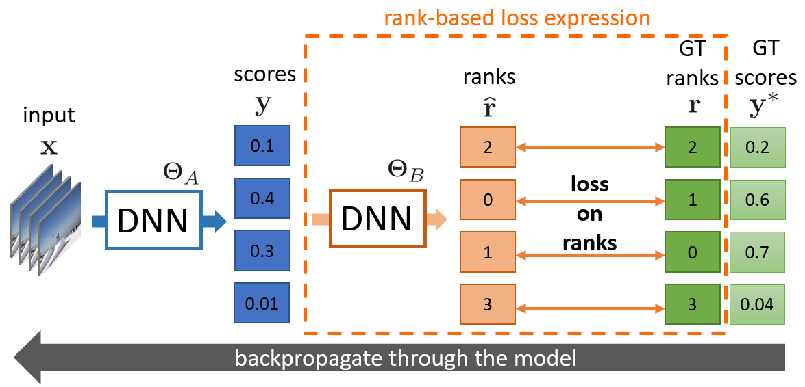

# SoDeep: A Sorting Deep Net to Learn Ranking Loss Surrogates
Code associated with the paper [SoDeep: A Sorting Deep Net to Learn Ranking Loss Surrogates](https://arxiv.org/pdf/1904.04272.pdf) 
<p align="center"> 

</p>
This code contains the loss functions derived from the following metrics.

* Spearman correlation
* Mean average Precision
* Recall

It also contains the code to train the approximation of the rank function (synthetic data generation, model architecture, training script).

Author and contact: Martin Engilberge

## Main dependencies

This code is written in python. To use it you will need:

* Python 3.7
* Pytorch 1.1
* Numpy
* TensorboardX

## Getting started

To be able to use the loss function, the first step is to train a sorter to approximate the ranking function.

```sh
python train.py
```

Once the training is finished, the sorter's checkpoints are stored in the weights folder.
By default the model used in the paper (lstm_large)  will be selected and the sequence length will be set to 100.
More models are present in model.py and can be selected with the argument -m.

```sh
python train.py -m gruc -n model_gruc
```

The GRU based model were developed after the publication of the paper and might perform better. 
The sorter_exact model doesn't need to be trained and can be used as a reliable baseline. 

By default the training scripts use gpu, you can switch to cpu mode by uncommenting `device = torch.device("cpu")` at the beginning of the script.

## Using the loss function

Once you have trained a sorter or if you decided to use the algorithmic one (sorter_exact) you can use the loss functions.

There are four losses

```python
SpearmanLoss(sorter_type, seq_len=None, sorter_state_dict=None)
MapRankingLoss(sorter_type, seq_len=None, sorter_state_dict=None)
#MultiModal rank based Loss
RankLoss(sorter_type, seq_len=None, sorter_state_dict=None)
#Hard negative MultiModal rank based Loss
RankHardLoss(sorter_type, seq_len=None, sorter_state_dict=None, margin=0.2)
```

Each loss function can take three main arguments:

* sorter_type: the model of sorter used
* seq_len: the length of sequence the sorter has been trained on
* sorter_state_dict: The state dict containing the weights of the sorter

The function load_sorter is provided to load the required argument all at once from a sorter checkpoints.

```python
import sys
sys.path.append("/path/to/sodeep/folder/")
from sodeep import load_sorter, SpearmanLoss

criterion = SpearmanLoss(*load_sorter(sorter_checkpoint_path))
criterion.to(device)
```

The syntax to use the programed sorter would be as follows:

```python
import sys
sys.path.append("/path/to/sodeep/folder/")
from sodeep import SpearmanLoss

criterion = SpearmanLoss("exa")
criterion.to(device)
```

The model.py file also contains an UpdatingWrapper which can be used to update the sorter on real data while it is used in a loss.
For stability reason it might be necessary to use the proposed loss in combination with another loss. 

On some regression task we noticed that initialization with an L1 loss for a couple of epochs was required before using the SpearmanLoss.

## Reference

If you found this code useful, please cite the following paper:

	@inproceedings{engilberge2019sodeep,
		title={SoDeep: A Sorting Deep Net to Learn Ranking Loss Surrogates},
		author={Engilberge, Martin and Chevallier, Louis and P{\'e}rez, Patrick and Cord, Matthieu},
		booktitle={Proceedings of the IEEE Conference on Computer Vision and Pattern Recognition},
		year={2019}
	}

## License 
This project is licensed under the terms of BSD 3-clause Clear license.
by downloading this program, you commit to comply with the license as stated in the LICENSE.md file.
